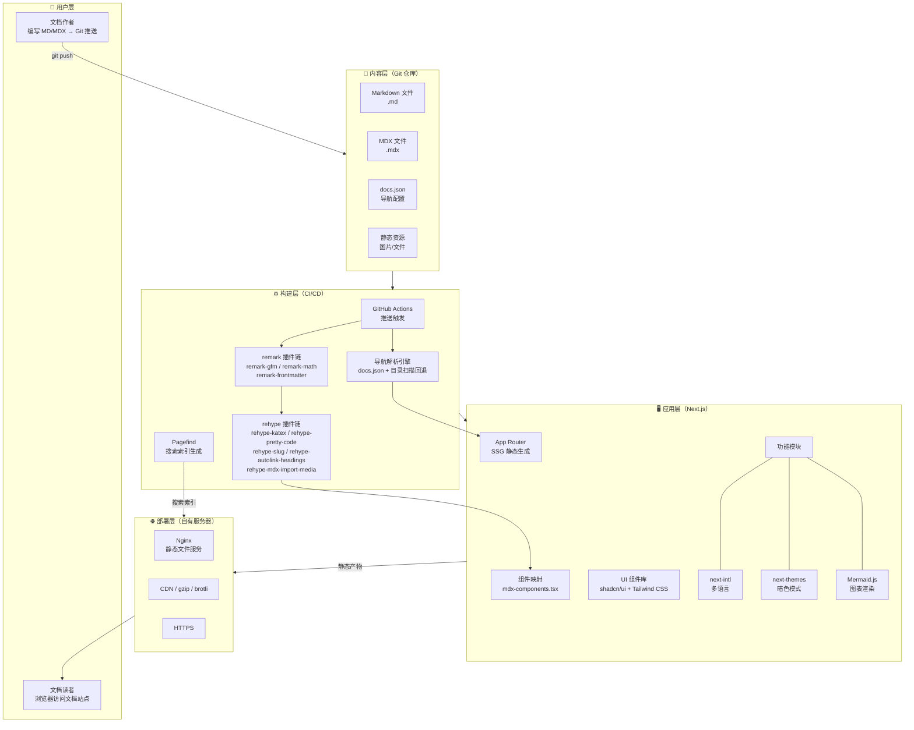
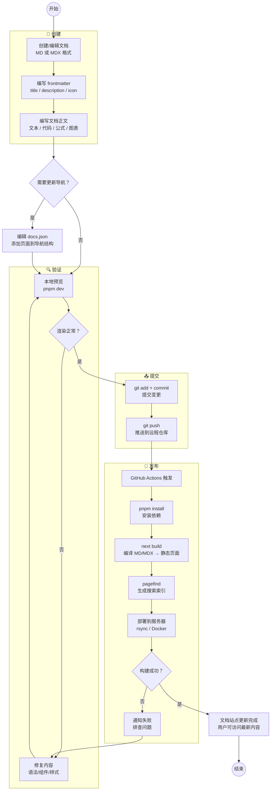
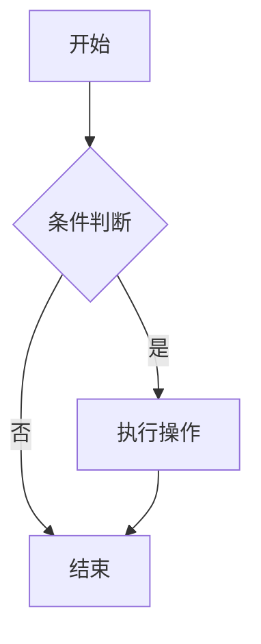
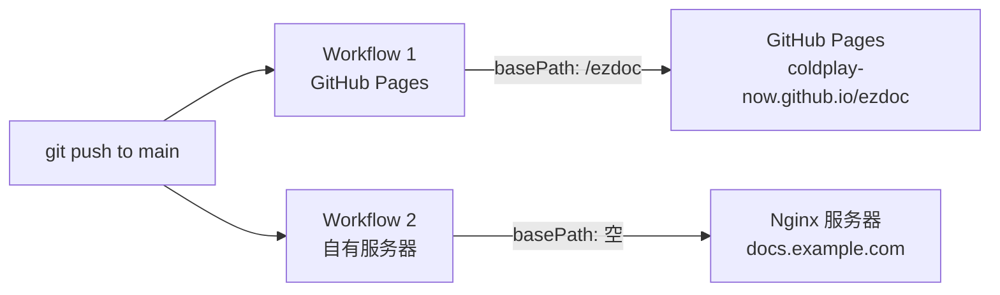

# ezdoc 产品需求文档（PRD）

## 1. 项目概述

**ezdoc** 是一个基于 Git 仓库的文档管理与渲染系统。用户在 Git 仓库中以 Markdown / MDX 格式编写文档，系统在构建时自动拉取内容并生成高质量的文档站点。

**项目性质**：私有项目

## 2. 目标用户与使用场景

| 场景 | 说明 |
|------|------|
| **个人/团队技术文档** | API 文档、技术方案、开发指南等内部技术资料 |
| **产品帮助中心** | 面向终端用户的帮助文档、FAQ、使用指南 |

## 3. 核心架构

### 3.1 系统架构图



### 3.2 用户管理文档流程



### 3.3 技术选型

| 层面 | 选型 | 理由 |
|------|------|------|
| 前端框架 | **Next.js (App Router)** | 成熟的 React 框架，原生支持 SSG、MDX，RSC 性能优势 |
| 内容格式 | **Markdown + MDX** | 同时支持 `.md` 和 `.mdx`，按需选择 |
| 渲染策略 | **SSG 纯静态导出** (`output: 'export'`) | 构建时编译，生成纯 HTML/CSS/JS，无需 Node.js 运行时 |
| 样式方案 | **Tailwind CSS + shadcn/ui** | 原子化 CSS + 高质量无障碍组件库 |
| 图片处理 | **构建时预处理（sharp）** | 纯静态导出不支持 next/image 服务端优化，构建时预先压缩 |
| 部署方式 | **自有服务器（Nginx 静态托管）** | 纯静态文件服务，无需 Node.js 进程 |
| 包管理器 | **pnpm** | 速度快、磁盘占用小 |

### 3.4 MDX 编译链路

全自研组装方案，不依赖 Fumadocs 等文档框架，每个环节完全可控。

#### remark 插件（Markdown AST 阶段）

| 插件 | 作用 |
|------|------|
| `remark-gfm` | 表格、任务列表、删除线、自动链接 |
| `remark-math` | 识别 `$...$` 行内和 `$$...$$` 块级数学公式语法 |
| `remark-frontmatter` | 解析 YAML frontmatter 元数据 |

#### rehype 插件（HTML AST 阶段）

| 插件 | 作用 |
|------|------|
| `rehype-katex` | 将数学公式渲染为 HTML（构建时编译，零客户端 JS） |
| `rehype-pretty-code` | 基于 Shiki 的代码语法高亮（VS Code 引擎，构建时生成） |
| `rehype-slug` | 为标题元素生成 id 锚点 |
| `rehype-autolink-headings` | 为标题添加可点击的锚点链接 |
| `rehype-mdx-import-media` | 自动将图片路径转为静态 import，接入 next/image 优化 |

#### 组件映射（mdx-components.tsx）

| HTML 元素 | 映射为 | 说明 |
|-----------|--------|------|
| `img` | `next/image` | 自动图片优化（压缩、WebP、懒加载、防布局偏移） |
| `a` | 自定义 Link 组件 | 外部链接 `target="_blank"`，内部链接用 Next.js `<Link>` |
| `pre/code` | CodeBlock 组件 | 复制按钮、行号、文件名标题 |
| mermaid 代码块 | Mermaid 组件 | 客户端渲染图表（`next/dynamic` + `ssr: false`） |

#### 编译流程总览

```
MDX/MD 源文件
  │
  ├── remark 阶段
  │   ├── remark-frontmatter   → 提取元数据
  │   ├── remark-gfm           → GFM 扩展语法
  │   └── remark-math          → 数学公式标记
  │
  ├── rehype 阶段
  │   ├── rehype-katex                → 数学公式 → HTML
  │   ├── rehype-pretty-code (Shiki)  → 代码高亮
  │   ├── rehype-slug                 → 标题锚点 id
  │   ├── rehype-autolink-headings    → 标题锚点链接
  │   └── rehype-mdx-import-media     → 图片静态 import
  │
  └── 组件映射
      ├── img     → next/image
      ├── a       → 智能 Link
      ├── pre     → CodeBlock
      └── mermaid → 客户端 Mermaid
```

### 3.5 项目配置文件（ezdoc.config.ts）

项目根目录的 `ezdoc.config.ts` 作为唯一配置入口，集中管理所有可配置项。`next.config.mjs` 和各模块在构建时读取此配置。

```ts
import { defineConfig } from './src/lib/config'

export default defineConfig({
  // ─── 站点基础信息 ───
  site: {
    title: 'My Docs',                    // 站点标题
    description: '项目文档中心',           // 站点描述（用于 SEO）
    logo: '/logo.svg',                    // Logo 路径（相对于 public/）
    favicon: '/favicon.ico',              // Favicon 路径
    url: 'https://docs.example.com',      // 站点线上地址
    socials: {                            // 社交链接（显示在顶部导航）
      github: 'https://github.com/user/repo',
      // twitter: 'https://twitter.com/...',
      // discord: 'https://discord.gg/...',
    },
  },

  // ─── 文档目录配置 ───
  docs: {
    dir: 'docs',                          // 文档内容根目录（相对于项目根）
    nav: 'docs.json',                     // 导航配置文件名（相对于 docs.dir）
  },

  // ─── 主题配置 ───
  theme: {
    defaultMode: 'system',                // 默认主题：'light' | 'dark' | 'system'
    primaryColor: '#3b82f6',              // 主题色
    // accentColor: '#8b5cf6',            // 强调色（可选）
  },

  // ─── 多语言配置 ───
  i18n: {
    defaultLocale: 'zh',                  // 默认语言
    locales: ['zh', 'en'],                // 支持的语言列表
  },

  // ─── 版本管理 ───
  versions: {
    current: 'v2',                        // 当前/默认版本
    list: ['v1', 'v2'],                   // 所有版本
  },

  // ─── 部署配置 ───
  deploy: {
    basePath: '',                         // 路由前缀（GitHub Pages 需设为 '/repo-name'）
    output: 'out',                        // 构建输出目录
  },
})
```

#### 配置项说明

| 分类 | 字段 | 必填 | 默认值 | 说明 |
|------|------|------|--------|------|
| **site** | `title` | 是 | - | 站点标题，显示在浏览器标签和导航栏 |
| | `description` | 否 | `''` | SEO 描述，用于 meta 标签和 Open Graph |
| | `logo` | 否 | - | Logo 图片路径 |
| | `favicon` | 否 | `/favicon.ico` | Favicon 路径 |
| | `url` | 否 | - | 线上地址，用于 sitemap 和 Open Graph |
| | `socials` | 否 | `{}` | 社交链接，key 为平台名，value 为 URL |
| **docs** | `dir` | 否 | `'docs'` | 文档内容根目录 |
| | `nav` | 否 | `'docs.json'` | 导航配置文件名 |
| **theme** | `defaultMode` | 否 | `'system'` | 默认主题模式 |
| | `primaryColor` | 否 | `'#3b82f6'` | 主题色（影响链接、按钮等） |
| **i18n** | `defaultLocale` | 否 | `'zh'` | 默认语言 |
| | `locales` | 否 | `['zh']` | 支持的语言列表，单语言时不显示切换器 |
| **versions** | `current` | 否 | - | 当前版本，不配置则不启用版本管理 |
| | `list` | 否 | `[]` | 版本列表，为空则不显示版本切换器 |
| **deploy** | `basePath` | 否 | `''` | 路由前缀，GitHub Pages 项目站点需设置 |
| | `output` | 否 | `'out'` | 构建输出目录 |

### 3.6 目录结构设计

```
ezdoc/
├── ezdoc.config.ts          # 项目配置文件（唯一配置入口）
├── docs/                    # 文档内容目录（可通过配置修改）
│   ├── docs.json            # 导航结构配置（可通过配置修改文件名）
│   ├── getting-started.md
│   ├── guides/
│   │   ├── installation.md
│   │   └── configuration.mdx
│   └── api/
│       └── reference.mdx
├── src/                     # 前端应用源码
│   ├── app/                 # Next.js App Router
│   ├── components/          # UI 组件
│   │   ├── Callout.tsx      # 提示框
│   │   ├── Tabs.tsx         # 选项卡
│   │   ├── CodeBlock.tsx    # 代码块增强
│   │   └── Mermaid.tsx      # Mermaid 图表（客户端渲染）
│   ├── lib/                 # 工具函数
│   │   ├── config.ts        # 配置加载与类型定义
│   │   ├── mdx.ts           # MDX 编译逻辑
│   │   ├── docs.ts          # 文档读取与导航生成
│   │   └── search.ts        # 搜索索引构建
│   └── mdx-components.tsx   # MDX 组件映射
├── public/
├── next.config.mjs          # 读取 ezdoc.config.ts 生成 Next.js 配置
├── tailwind.config.ts
├── tsconfig.json
└── package.json
```

## 4. 文档导航结构

采用 **docs.json 配置 + 目录扫描回退** 的混合模式。

### 4.1 docs.json 格式定义

```json
{
  "navigation": [
    {
      "group": "快速开始",
      "pages": [
        "getting-started",
        "installation"
      ]
    },
    {
      "group": "使用指南",
      "pages": [
        {
          "title": "配置说明",
          "path": "guides/configuration"
        },
        "guides/advanced"
      ]
    },
    {
      "group": "API 参考",
      "pages": [
        "api/reference"
      ]
    }
  ]
}
```

### 4.2 导航解析逻辑

1. 构建时优先读取 `docs/docs.json`
2. 如果 `docs.json` 不存在或未覆盖某些文件，回退到扫描 `docs/` 目录
3. 回退时按文件名字母顺序排列，目录作为分组名
4. 每篇文档的标题优先读取文件内的 frontmatter `title` 字段，其次用文件名

## 5. 内容格式规范

### 5.1 Frontmatter

每篇文档支持 YAML frontmatter：

```yaml
---
title: 快速开始
description: 5 分钟上手 ezdoc
icon: rocket
---
```

### 5.2 Markdown 支持

标准 CommonMark 语法，额外支持：
- GFM（GitHub Flavored Markdown）：表格、任务列表、删除线
- 语法高亮的代码块
- 自动生成的目录锚点（TOC）

### 5.3 MDX 支持

在 `.mdx` 文件中可直接使用预注册的内置组件，无需 import：

```mdx
---
title: 配置说明
---

# 配置说明

<Callout type="warning">
  修改配置后需要重新启动服务。
</Callout>

<Tabs items={["npm", "yarn", "pnpm"]}>
  <Tab value="npm">npm install ezdoc</Tab>
  <Tab value="yarn">yarn add ezdoc</Tab>
  <Tab value="pnpm">pnpm add ezdoc</Tab>
</Tabs>
```

## 6. 内容渲染能力

### 6.1 图片

- Markdown 标准图片语法 `` 自动映射到 `next/image`
- 支持本地图片和远程图片
- 自动优化：压缩、WebP 转换、响应式尺寸、懒加载
- 防止 CLS（累积布局偏移）

### 6.2 链接

- 内部链接自动使用 Next.js `<Link>` 组件，实现客户端路由跳转（无刷新）
- 外部链接自动添加 `target="_blank"` 和 `rel="noopener noreferrer"`
- 标题锚点链接：每个标题自动生成 id 和可点击的锚点图标

### 6.3 数学公式

基于 KaTeX，构建时编译为 HTML，零客户端 JS 开销。

行内公式：

```markdown
质能方程 $E = mc^2$ 是物理学的基础公式。
```

块级公式：

```markdown
$$
\int_{-\infty}^{\infty} e^{-x^2} dx = \sqrt{\pi}
$$
```

### 6.4 Mermaid 图表

在 fenced code block 中使用 `mermaid` 语言标记，客户端渲染为 SVG 图表。

支持的图表类型：流程图、时序图、甘特图、类图、状态图、ER 图、饼图等。

~~~markdown

~~~

暗色模式下自动切换 Mermaid 主题。

### 6.5 表格

GFM 标准表格语法，支持对齐方式：

```markdown
| 左对齐 | 居中 | 右对齐 |
|:-------|:----:|-------:|
| 内容   | 内容 |   内容 |
```

## 7. 内置组件

### 7.1 Callout / 提示框

支持的类型：`info` | `warning` | `error` | `tip`

```mdx
<Callout type="info">这是一条提示信息。</Callout>
<Callout type="warning">请注意此操作不可逆。</Callout>
<Callout type="error">操作失败，请重试。</Callout>
<Callout type="tip">你可以使用快捷键加速操作。</Callout>
```

### 7.2 Tabs / 选项卡

用于多语言代码示例、多平台说明等场景：

```mdx
<Tabs items={["JavaScript", "Python"]}>
  <Tab value="JavaScript">console.log('hello')</Tab>
  <Tab value="Python">print('hello')</Tab>
</Tabs>
```

### 7.3 CodeBlock / 代码块增强

基于 fenced code block 自动增强：
- 语法高亮（基于 Shiki，构建时生成，零 JS）
- 显示行号
- 复制按钮
- 文件名标题显示

~~~markdown
```js title="example.js" showLineNumbers
function hello() {
  console.log('hello ezdoc')
}
```
~~~

## 8. 功能需求

### 8.1 全文搜索

| 项目 | 说明 |
|------|------|
| 方案 | 构建后自动扫描 HTML 生成索引，客户端按需加载索引分片 |
| 技术 | **Pagefind** |
| 范围 | 标题 + 正文内容 |
| 交互 | 快捷键（Ctrl/Cmd + K）唤起搜索框，实时显示结果 |
| 优势 | 零配置、低带宽、支持大规模文档 |

### 8.2 多语言 / i18n

| 项目 | 说明 |
|------|------|
| 技术 | **next-intl** |
| 目录结构 | `docs/zh/`、`docs/en/` 按语言分目录 |
| 切换方式 | 顶部导航语言切换器 |
| 默认语言 | 中文（zh） |
| 路由规则 | `/zh/getting-started`、`/en/getting-started` |

### 8.3 暗色模式

| 项目 | 说明 |
|------|------|
| 技术 | **next-themes** |
| 模式 | 亮色 / 暗色 / 跟随系统，三档切换 |
| 实现 | CSS 变量 + Tailwind `dark:` 前缀 |
| 持久化 | localStorage 记住用户选择 |

### 8.4 版本管理

| 项目 | 说明 |
|------|------|
| 方案 | 按目录区分版本（`docs/v1/`、`docs/v2/`） |
| 切换方式 | 顶部导航版本选择器 |
| 默认版本 | 最新版本 |
| 路由规则 | `/v2/getting-started`、`/v1/getting-started` |

## 9. 页面布局

### 9.1 整体结构

```
┌──────────────────────────────────────────────┐
│  顶部导航栏：Logo | 搜索 | 版本 | 语言 | 主题 │
├──────────┬────────────────────────┬──────────┤
│          │                        │          │
│  左侧    │      文档正文区域       │  右侧    │
│  导航栏  │                        │  TOC     │
│          │                        │  目录    │
│          │                        │          │
├──────────┴────────────────────────┴──────────┤
│  底部：上一篇 / 下一篇导航                      │
└──────────────────────────────────────────────┘
```

### 9.2 响应式设计

- **桌面端（>1024px）**：三栏布局，左侧导航 + 正文 + 右侧 TOC
- **平板端（768-1024px）**：隐藏右侧 TOC，左侧导航可折叠
- **移动端（<768px）**：汉堡菜单，单栏正文

## 10. 部署方案

采用**双 workflow 并行部署**：GitHub Pages 作为公开示例站，自有服务器作为生产环境。



### 10.1 Workflow 1：GitHub Pages（示例站）

| 项目 | 说明 |
|------|------|
| 触发条件 | push 到 main 分支 |
| basePath | `/ezdoc`（项目站点前缀） |
| 部署目标 | GitHub Pages（`gh-pages` 分支） |
| 访问地址 | `https://coldplay-now.github.io/ezdoc/` |
| 用途 | 公开演示、效果预览 |

### 10.2 Workflow 2：自有服务器（生产环境）

| 项目 | 说明 |
|------|------|
| 触发条件 | push 到 main 分支（或打 release 标签） |
| basePath | 空（域名根路径） |
| 部署目标 | rsync over SSH 到 Nginx 服务器 |
| 访问地址 | `https://docs.example.com/` |
| 用途 | 正式生产环境 |

### 10.3 构建流程

两个 workflow 共享相同的构建步骤，仅 `basePath` 不同：

```
pnpm install
  → ezdoc.config.ts 读取配置（basePath 由环境变量覆盖）
  → next build（输出到 out/）
  → pagefind --site out/（生成搜索索引）
  → 部署到目标环境
```

### 10.4 服务器要求

- Nginx 静态文件服务器（无需 Node.js 运行时）
- 启用 gzip/brotli 压缩
- 配置 HTTPS（Let's Encrypt）
- 详细部署规格见 `docs/deployment.md`

## 11. 技术栈总览

| 层面 | 方案 |
|------|------|
| 框架 | Next.js (App Router) |
| 语言 | TypeScript |
| 样式 | Tailwind CSS |
| UI 组件 | shadcn/ui (Radix UI) |
| MDX 编译 | next-mdx-remote |
| 语法高亮 | Shiki (rehype-pretty-code) |
| 数学公式 | remark-math + rehype-katex |
| 图表 | Mermaid.js（客户端渲染） |
| 图片优化 | 构建时 sharp 预处理 + rehype-mdx-import-media |
| 搜索 | Pagefind |
| 多语言 | next-intl |
| 暗色模式 | next-themes |
| 包管理 | pnpm |
| CI/CD | GitHub Actions |

## 12. 里程碑

### P0 - 核心功能

- 项目初始化（Next.js + Tailwind + shadcn/ui）
- `ezdoc.config.ts` 配置文件体系
- MDX 编译链路搭建（remark/rehype 插件全链路）
- docs.json 导航解析 + 目录扫描回退
- Markdown / MDX 渲染（图片、链接、表格）
- 数学公式渲染（KaTeX）
- Mermaid 图表渲染
- 内置组件：Callout、Tabs、CodeBlock
- 基础页面布局（三栏 + 响应式）
- 暗色模式

### P1 - 增强功能

- 全文搜索（Pagefind）
- 多语言支持（next-intl）
- 上一篇/下一篇导航
- SEO 优化（sitemap、meta tags、Open Graph）
- GitHub Pages 部署 workflow
- 自有服务器部署 workflow

### P2 - 进阶功能

- 版本管理
- 更多内置组件扩展
