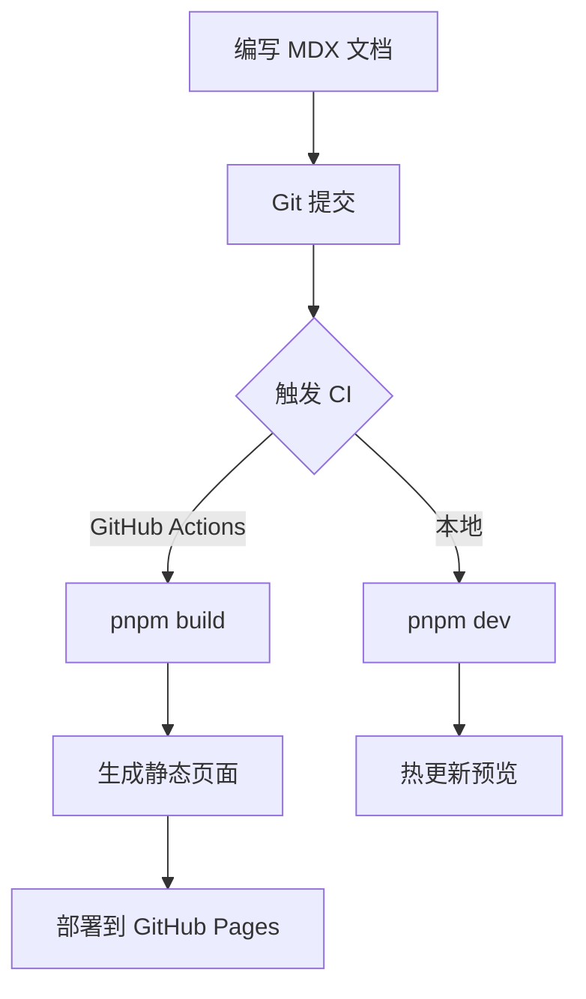
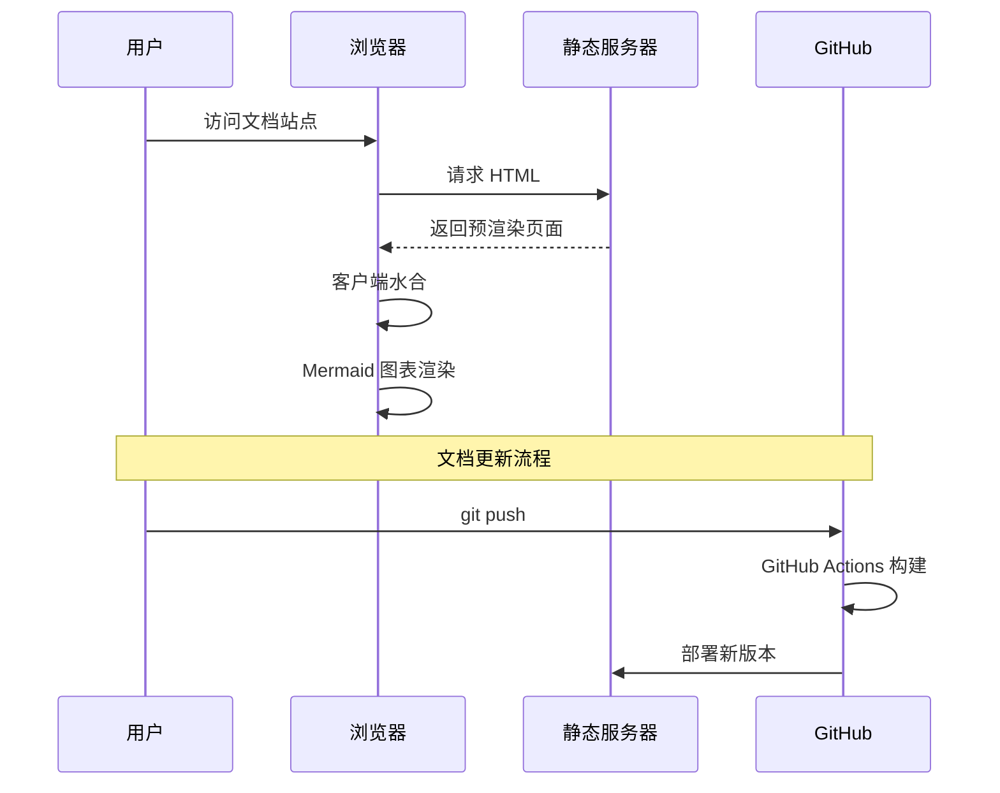
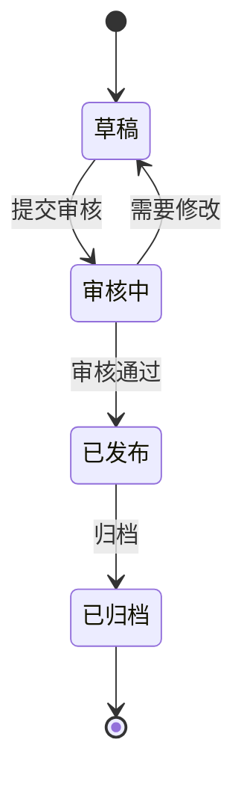
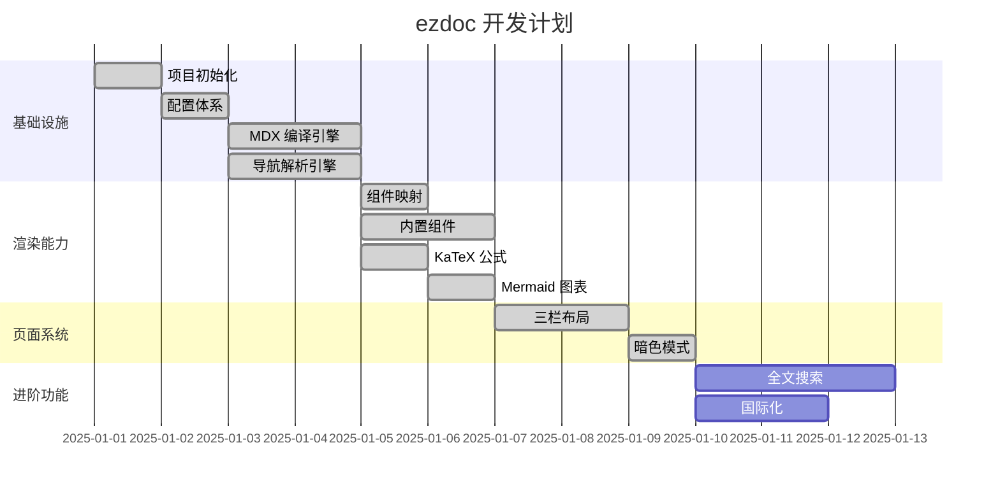
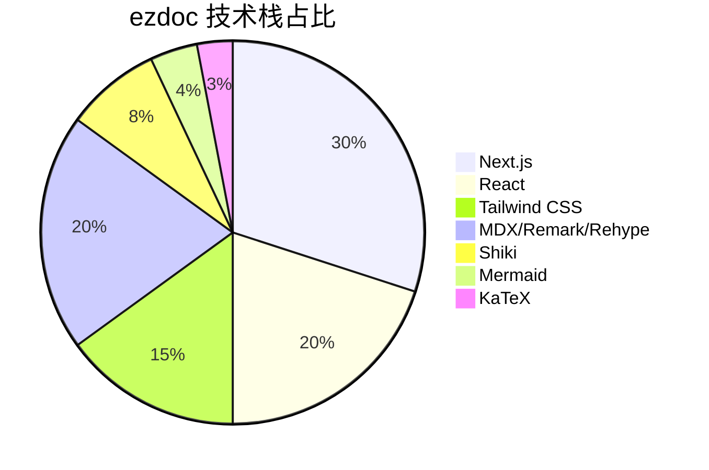
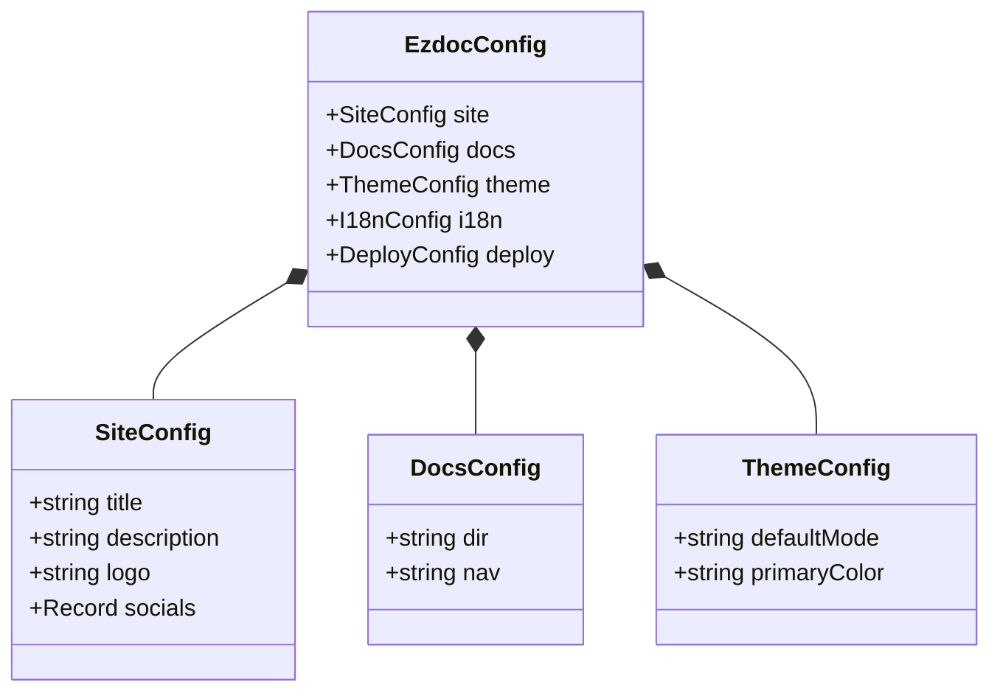

## 数学公式

ezdoc 使用 KaTeX 在构建时编译数学公式，无需客户端 JavaScript，渲染速度极快。

### 行内公式

在正文中使用 `$...$` 插入行内公式：

- 质能方程 $E = mc^2$ 揭示了质量与能量的等价关系
- 欧拉恒等式 $e^{i\pi} + 1 = 0$ 被誉为最优美的数学公式
- 二次方程求根公式 $x = \frac{-b \pm \sqrt{b^2 - 4ac}}{2a}$
- 勾股定理 $a^2 + b^2 = c^2$

### 块级公式

使用 `$$...$$` 创建居中显示的块级公式：

**高斯积分**

$$
\int_{-\infty}^{\infty} e^{-x^2} \, dx = \sqrt{\pi}
$$

**欧拉公式**

$$
e^{ix} = \cos x + i \sin x
$$

**巴塞尔问题**

$$
\sum_{n=1}^{\infty} \frac{1}{n^2} = \frac{\pi^2}{6}
$$

**麦克斯韦方程组**

$$
\begin{aligned}
\nabla \cdot \mathbf{E} &= \frac{\rho}{\varepsilon_0} \\
\nabla \cdot \mathbf{B} &= 0 \\
\nabla \times \mathbf{E} &= -\frac{\partial \mathbf{B}}{\partial t} \\
\nabla \times \mathbf{B} &= \mu_0 \mathbf{J} + \mu_0 \varepsilon_0 \frac{\partial \mathbf{E}}{\partial t}
\end{aligned}
$$

**矩阵运算**

$$
\mathbf{A} = \begin{pmatrix}
a_{11} & a_{12} & a_{13} \\
a_{21} & a_{22} & a_{23} \\
a_{31} & a_{32} & a_{33}
\end{pmatrix}, \quad
\det(\mathbf{A}) = \sum_{\sigma \in S_3} \text{sgn}(\sigma) \prod_{i=1}^{3} a_{i,\sigma(i)}
$$

**贝叶斯定理**

$$
P(A \mid B) = \frac{P(B \mid A) \, P(A)}{P(B)}
$$

---

## Mermaid 图表

ezdoc 支持 Mermaid 图表的客户端渲染，会自动跟随亮暗主题切换配色。

### 流程图

### 时序图

### 状态图

### 甘特图

### 饼图

### 类图

