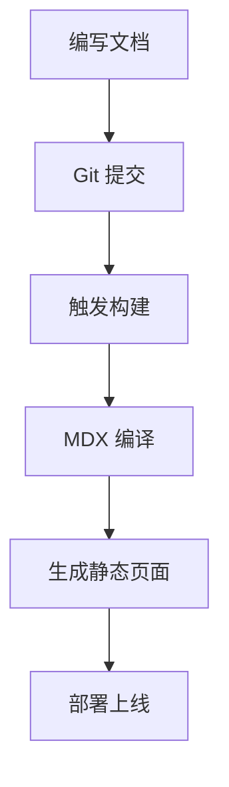
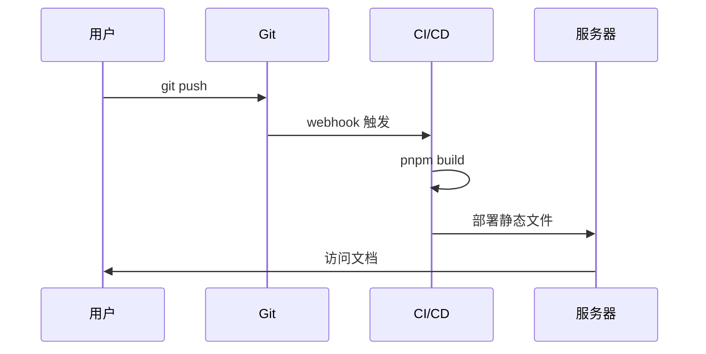

## Callout 提示框

使用 `Callout` 组件来高亮重要信息：

<Callout type="info" title="提示">
  这是一条信息提示。
</Callout>

<Callout type="warning" title="注意">
  请确保你的 Node.js 版本 >= 20。
</Callout>

<Callout type="error" title="危险">
  此操作不可逆，请谨慎执行。
</Callout>

<Callout type="tip" title="技巧">
  使用 `pnpm` 可以获得更快的安装速度。
</Callout>

## Tabs 标签页

使用 `Tabs` 和 `TabItem` 来展示多种方案：

<Tabs defaultValue="pnpm">
  <TabItem label="pnpm" value="pnpm">
    ```bash
    pnpm install
    ```
  </TabItem>
  <TabItem label="npm" value="npm">
    ```bash
    npm install
    ```
  </TabItem>
  <TabItem label="yarn" value="yarn">
    ```bash
    yarn
    ```
  </TabItem>
</Tabs>

## 代码块

### 语法高亮

ezdoc 使用 Shiki 提供语法高亮，支持多种语言：

```typescript
interface User {
  id: number;
  name: string;
  email: string;
}

function greet(user: User): string {
  return `Hello, ${user.name}!`;
}
```

```python
def fibonacci(n: int) -> list[int]:
    """Generate Fibonacci sequence."""
    fib = [0, 1]
    for i in range(2, n):
        fib.append(fib[i-1] + fib[i-2])
    return fib[:n]
```

## 数学公式

ezdoc 支持 LaTeX 数学公式。

行内公式：质能方程 $E = mc^2$ 是物理学中最著名的公式之一。

块级公式：

$$
\int_{-\infty}^{\infty} e^{-x^2} dx = \sqrt{\pi}
$$

$$
\sum_{n=1}^{\infty} \frac{1}{n^2} = \frac{\pi^2}{6}
$$

## Mermaid 图表

ezdoc 支持 Mermaid 图表渲染：




