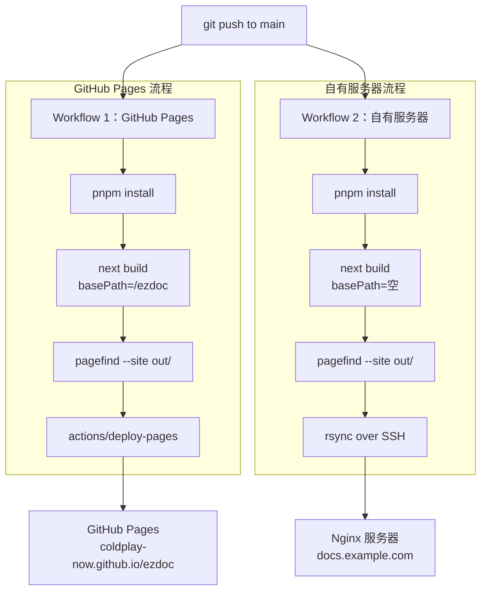

# ezdoc 部署关注点

## 1. 部署架构总览



ezdoc 采用 **纯静态导出**（`output: 'export'`）+ **双 workflow 并行部署**。构建产物是纯 HTML/CSS/JS 文件，**不需要 Node.js 运行时**。

| 环境 | 用途 | 访问地址 |
|------|------|---------|
| GitHub Pages | 公开示例站 | `https://coldplay-now.github.io/ezdoc/` |
| 自有服务器 | 生产环境 | `https://docs.example.com/` |

---

## 2. Next.js 静态导出的约束

使用 `output: 'export'` 后，以下 Next.js 特性**不可用**：

| 不可用特性 | 影响 | 替代方案 |
|-----------|------|---------|
| `next/image` 服务端优化 | 无法运行时压缩、转 WebP、调整尺寸 | 构建时用 sharp 预处理图片 |
| API Routes | 无法提供后端接口 | 不需要（纯文档站） |
| ISR / SSR | 无法增量更新 | 全量重新构建 |
| Middleware | 无法做请求级处理 | Nginx rewrite 规则替代 |
| `headers` / `rewrites` in next.config | 不生效 | 在 Nginx 配置中实现 |

### 2.1 next.config.mjs 关键配置

```js
// next.config.mjs 从 ezdoc.config.ts 读取配置
// basePath 可通过环境变量 EZDOC_BASE_PATH 覆盖（CI 中使用）
const basePath = process.env.EZDOC_BASE_PATH ?? ezdocConfig.deploy.basePath

const nextConfig = {
  output: 'export',          // 纯静态导出
  basePath,                   // GitHub Pages 需设为 '/ezdoc'，生产环境为空
  trailingSlash: true,       // 生成 /path/index.html，Nginx 友好
  images: {
    unoptimized: true,        // 禁用服务端图片优化
  },
}
```

`trailingSlash: true` 非常重要——它让每个路由生成 `path/index.html` 而不是 `path.html`，Nginx 默认就能正确匹配目录索引，无需额外配置。

---

## 3. 图片处理方案

纯静态导出下 `next/image` 的优化 API 不可用，需要在构建时预先处理图片。

### 3.1 构建时处理流程

```
原始图片 → sharp 批量处理 → 输出优化后的图片 → 打包进静态产物
```

### 3.2 处理策略

| 操作 | 说明 |
|------|------|
| 格式转换 | 将 PNG/JPG 转为 WebP，保留原格式作为 fallback |
| 压缩 | quality 设为 80，兼顾体积和清晰度 |
| 响应式尺寸 | 生成多套尺寸（640/1024/1440），配合 `srcset` |
| 懒加载 | 使用浏览器原生 `loading="lazy"`，无需 JS |

### 3.3 在 mdx-components.tsx 中的映射

由于 `next/image` 的优化功能被禁用，建议自定义 `img` 组件：
- 添加 `loading="lazy"` 和 `decoding="async"`
- 设置合理的 `width`/`height` 防止 CLS
- 远程图片直接使用 `` 标签

---

## 4. Pagefind 搜索索引

### 4.1 构建顺序（严格）

```bash
# 1. 先构建 Next.js 静态产物
pnpm build

# 2. 再对 HTML 产物生成搜索索引
npx pagefind --site out
```

**顺序不能反**。Pagefind 扫描的是已生成的 HTML 文件，如果在 `next build` 之前运行，索引为空。

### 4.2 Pagefind 产物

Pagefind 会在 `out/pagefind/` 下生成：

```
out/pagefind/
├── pagefind.js            # 客户端搜索库
├── pagefind-ui.js         # 可选的搜索 UI
├── pagefind-ui.css        # 搜索 UI 样式
├── pagefind-entry.json    # 索引入口
├── fragment/              # 搜索结果片段
│   ├── xxxxxx.pf_fragment
│   └── ...
└── index/                 # 索引分片（按需加载）
    ├── xxxxxx.pf_index
    └── ...
```

### 4.3 注意事项

- `.pf_fragment` 和 `.pf_index` 文件需要 Nginx 正确返回（不要被拦截或 404）
- 索引文件建议短缓存（`max-age=3600`），保证更新后搜索内容及时生效
- 多语言场景下，Pagefind 支持 `--site out/zh` 等按目录分别建索引

---

## 5. KaTeX 静态资源

### 5.1 字体文件

KaTeX 依赖自定义字体文件（.woff2）来渲染数学符号。构建时通过 `import 'katex/dist/katex.min.css'` 引入，打包工具会自动把字体文件拷贝到产物中。

### 5.2 常见问题

| 问题 | 原因 | 解决 |
|------|------|------|
| 公式文字错位/乱码 | 字体文件路径 404 | 检查构建产物中 `_next/static/` 下是否有 `.woff2` 文件 |
| 公式完全不渲染 | 未引入 katex.css | 确认在 layout.tsx 中 import 了 katex.css |
| 构建报错 ESM 兼容 | rehype-katex 版本不匹配 | 使用 rehype-katex v7+，配合 `"type": "module"` |

---

## 6. Mermaid 客户端加载策略

Mermaid.js 体积约 480KB（gzip 后约 150KB），不应全站加载。

### 6.1 按需加载

```tsx
// 使用 next/dynamic 仅在需要时加载
const Mermaid = dynamic(() => import('@/components/Mermaid'), {
  ssr: false,     // 禁用 SSR，Mermaid 依赖浏览器 DOM
  loading: () => <div>图表加载中...</div>,
})
```

只有页面中实际包含 mermaid 代码块时，才触发加载。

### 6.2 暗色模式适配

Mermaid 需要根据当前主题切换配色：

| 主题 | Mermaid theme |
|------|---------------|
| 亮色 | `default` |
| 暗色 | `dark` |

监听 `next-themes` 的主题变化，重新调用 `mermaid.run()` 刷新图表。

---

## 7. CI/CD 配置（GitHub Actions）

### 7.1 Workflow 1：GitHub Pages（示例站）

```yaml
# .github/workflows/deploy-pages.yml
name: Deploy to GitHub Pages

on:
  push:
    branches: [main]

permissions:
  contents: read
  pages: write
  id-token: write

concurrency:
  group: "pages"
  cancel-in-progress: true

jobs:
  build:
    runs-on: ubuntu-latest
    steps:
      - uses: actions/checkout@v4

      - uses: pnpm/action-setup@v4
        with:
          version: 9

      - uses: actions/setup-node@v4
        with:
          node-version: 20
          cache: 'pnpm'

      - name: Install dependencies
        run: pnpm install --frozen-lockfile

      - name: Build
        run: pnpm build
        env:
          EZDOC_BASE_PATH: /ezdoc    # GitHub Pages 项目前缀

      - name: Generate search index
        run: npx pagefind --site out

      - name: Upload artifact
        uses: actions/upload-pages-artifact@v3
        with:
          path: out

  deploy:
    needs: build
    runs-on: ubuntu-latest
    environment:
      name: github-pages
      url: ${{ steps.deployment.outputs.page_url }}
    steps:
      - name: Deploy to GitHub Pages
        id: deployment
        uses: actions/deploy-pages@v4
```

### 7.2 Workflow 2：自有服务器（生产环境）

```yaml
# .github/workflows/deploy-server.yml
name: Deploy to Server

on:
  push:
    branches: [main]

jobs:
  deploy:
    runs-on: ubuntu-latest
    steps:
      - uses: actions/checkout@v4

      - uses: pnpm/action-setup@v4
        with:
          version: 9

      - uses: actions/setup-node@v4
        with:
          node-version: 20
          cache: 'pnpm'

      - name: Install dependencies
        run: pnpm install --frozen-lockfile

      - name: Build
        run: pnpm build
        # 不设 EZDOC_BASE_PATH，使用 ezdoc.config.ts 中的默认值（空）

      - name: Generate search index
        run: npx pagefind --site out

      - name: Deploy to server
        uses: easingthemes/ssh-deploy@v5
        with:
          SSH_PRIVATE_KEY: ${{ secrets.SSH_PRIVATE_KEY }}
          REMOTE_HOST: ${{ secrets.REMOTE_HOST }}
          REMOTE_USER: ${{ secrets.REMOTE_USER }}
          SOURCE: "out/"
          TARGET: "/var/www/ezdoc"
          ARGS: "-az --delete"
```

### 7.3 basePath 环境变量机制

两个 workflow 唯一的区别是 `EZDOC_BASE_PATH` 环境变量：

| 环境 | `EZDOC_BASE_PATH` | 实际 basePath | 效果 |
|------|-------------------|---------------|------|
| GitHub Pages | `/ezdoc` | `/ezdoc` | 所有资源路径带 `/ezdoc/` 前缀 |
| 自有服务器 | 不设置 | `''`（空） | 域名根路径访问 |

`next.config.mjs` 中的处理逻辑：

```js
const basePath = process.env.EZDOC_BASE_PATH ?? ezdocConfig.deploy.basePath ?? ''
```

### 7.4 需要配置的 Secrets

| Secret | 用于 | 说明 |
|--------|------|------|
| `SSH_PRIVATE_KEY` | Workflow 2 | 部署用的 SSH 私钥 |
| `REMOTE_HOST` | Workflow 2 | 服务器 IP 或域名 |
| `REMOTE_USER` | Workflow 2 | SSH 登录用户名 |

GitHub Pages workflow **不需要额外 Secrets**，使用 GitHub 内置的 `GITHUB_TOKEN` 即可。

### 7.5 GitHub Pages 首次启用

需要在仓库设置中开启 GitHub Pages：

1. 进入仓库 → Settings → Pages
2. Source 选择 **GitHub Actions**（不是 Deploy from a branch）
3. 首次 push 后 workflow 会自动部署

### 7.6 安全注意事项

- 部署用的 SSH 密钥建议单独生成，仅赋予 rsync 目标目录的写权限
- 私有仓库的 Actions 日志默认不公开，但仍要避免在 `run` 中 echo 敏感信息
- `--frozen-lockfile` 确保 CI 使用锁定版本，避免构建不一致
- `concurrency` 配置确保同一时间只有一个 Pages 部署在运行

---

## 8. Nginx 配置

### 8.1 基础站点配置

```nginx
server {
    listen 443 ssl http2;
    server_name docs.example.com;

    ssl_certificate     /etc/letsencrypt/live/docs.example.com/fullchain.pem;
    ssl_certificate_key /etc/letsencrypt/live/docs.example.com/privkey.pem;

    root /var/www/ezdoc;
    index index.html;

    # 静态文件路由
    location / {
        try_files $uri $uri/ =404;
    }

    # 带 hash 的静态资源 - 长期缓存
    location /_next/static/ {
        expires 1y;
        add_header Cache-Control "public, immutable";
    }

    # HTML 文件 - 不缓存
    location ~* \.html$ {
        add_header Cache-Control "no-cache";
    }

    # Pagefind 搜索索引 - 短缓存
    location /pagefind/ {
        expires 1h;
        add_header Cache-Control "public";
    }

    # KaTeX 字体文件
    location ~* \.(woff|woff2)$ {
        expires 1y;
        add_header Cache-Control "public, immutable";
    }

    # gzip 压缩
    gzip on;
    gzip_types text/html text/css application/javascript application/json image/svg+xml;
    gzip_min_length 1024;

    # brotli 压缩（需安装 ngx_brotli 模块）
    # brotli on;
    # brotli_types text/html text/css application/javascript application/json image/svg+xml;
}

# HTTP → HTTPS 重定向
server {
    listen 80;
    server_name docs.example.com;
    return 301 https://$server_name$request_uri;
}
```

### 8.2 关键配置说明

| 配置项 | 说明 |
|--------|------|
| `try_files $uri $uri/ =404` | 配合 `trailingSlash: true`，`/path/` 自动找 `/path/index.html` |
| `/_next/static/` 长缓存 | JS/CSS 文件名含 hash，内容变更时文件名也变，可安全长期缓存 |
| HTML 不缓存 | 保证用户始终访问到最新版本的页面 |
| Pagefind 短缓存 | 搜索索引每次构建都会更新，1 小时缓存是合理的平衡 |

### 8.3 多语言路由

多语言目录结构生成的静态文件天然匹配 Nginx 路由：

```
out/
├── zh/
│   ├── getting-started/index.html    → /zh/getting-started/
│   └── guides/
│       └── installation/index.html   → /zh/guides/installation/
└── en/
    ├── getting-started/index.html    → /en/getting-started/
    └── guides/
        └── installation/index.html   → /en/guides/installation/
```

如果需要根路径 `/` 自动跳转到默认语言：

```nginx
location = / {
    return 302 /zh/;
}
```

### 8.4 版本路由

同理，版本目录也是天然匹配：

```
out/
├── v1/zh/getting-started/index.html  → /v1/zh/getting-started/
└── v2/zh/getting-started/index.html  → /v2/zh/getting-started/
```

默认版本跳转：

```nginx
location = / {
    return 302 /v2/zh/;
}
```

---

## 9. 多语言与版本的构建体积

### 9.1 体积估算

每增加一种语言或一个版本，构建产物**近似线性增长**：

| 规模 | 估算体积（不含图片） |
|------|---------------------|
| 100 篇文档 × 1 语言 × 1 版本 | ~20-30 MB |
| 100 篇文档 × 2 语言 × 1 版本 | ~40-60 MB |
| 100 篇文档 × 2 语言 × 3 版本 | ~120-180 MB |

### 9.2 优化策略

| 策略 | 说明 |
|------|------|
| rsync 增量同步 | `rsync -az --delete` 只传输变更文件，不是全量上传 |
| 构建缓存 | GitHub Actions 缓存 `node_modules` 和 `.next/cache`，加速重复构建 |
| 旧版本冻结 | 已归档的版本不再重新构建，只构建当前活跃版本 |
| 图片集中管理 | 图片放在 `public/images/` 下跨版本共享，避免重复打包 |

### 9.3 构建时间参考

| 规模 | GitHub Actions 预估构建时间 |
|------|---------------------------|
| 50 篇文档 | ~30-60 秒 |
| 200 篇文档 | ~2-3 分钟 |
| 500 篇文档 × 多语言 | ~5-8 分钟 |

---

## 10. HTTPS 配置

### 10.1 Let's Encrypt + Certbot

```bash
# 安装 certbot
apt install certbot python3-certbot-nginx

# 申请证书（自动配置 Nginx）
certbot --nginx -d docs.example.com

# 自动续签（certbot 默认会添加定时任务）
certbot renew --dry-run
```

### 10.2 SSL 安全加固

```nginx
# 推荐的 SSL 配置
ssl_protocols TLSv1.2 TLSv1.3;
ssl_ciphers ECDHE-ECDSA-AES128-GCM-SHA256:ECDHE-RSA-AES128-GCM-SHA256;
ssl_prefer_server_ciphers off;
ssl_session_timeout 1d;
ssl_session_cache shared:SSL:10m;
ssl_session_tickets off;

# HSTS
add_header Strict-Transport-Security "max-age=63072000" always;
```

---

## 11. 监控与排错

### 11.1 部署后验证清单

- [ ] 首页正常加载
- [ ] 文档页面内容正确渲染
- [ ] 代码块语法高亮正常
- [ ] 数学公式渲染正常（检查字体是否加载）
- [ ] Mermaid 图表渲染正常
- [ ] 搜索功能可用（Ctrl/Cmd + K）
- [ ] 暗色模式切换正常
- [ ] 多语言切换正常（如已启用）
- [ ] 内外部链接跳转正常
- [ ] 移动端响应式布局正常

### 11.2 常见问题排查

| 问题 | 可能原因 | 排查方法 |
|------|---------|---------|
| 页面 404 | `trailingSlash` 配置不一致 | 检查 out/ 目录结构是否有 `path/index.html` |
| 搜索无结果 | Pagefind 未运行或路径错误 | 检查 `out/pagefind/` 目录是否存在且有内容 |
| 公式渲染异常 | KaTeX 字体 404 | 浏览器 DevTools Network 面板检查 `.woff2` 请求 |
| 图表不显示 | Mermaid JS 未加载 | 检查是否有 `dynamic import` 且 `ssr: false` |
| 样式丢失 | CSS 文件缓存问题 | 硬刷新（Ctrl+Shift+R），检查 Nginx 缓存配置 |
| 部署后内容未更新 | HTML 被浏览器缓存 | 确认 HTML 文件的 `Cache-Control: no-cache` |
| 构建产物过大 | 图片未压缩 | 检查 sharp 预处理流程是否执行 |
