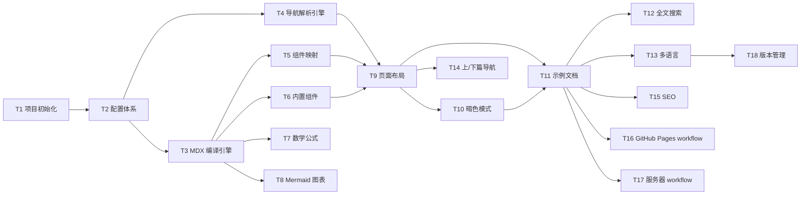

# ezdoc 项目 Task 计划

## Task 依赖关系



---

## P0 — 核心功能

### T1 项目初始化

| 项目 | 说明 |
|------|------|
| 前置 | 无 |
| 产出 | 可运行的 Next.js 空项目 |

- [ ] `pnpm create next-app` 初始化（App Router, TypeScript, Tailwind CSS, ESLint）
- [ ] 配置 `output: 'export'` 和 `trailingSlash: true`
- [ ] 安装 shadcn/ui，初始化 `components.json`
- [ ] 目录结构搭建（`src/app`、`src/components`、`src/lib`、`docs/`）
- [ ] 验证：`pnpm dev` 启动正常，`pnpm build` 静态导出到 `out/`

### T2 配置体系

| 项目 | 说明 |
|------|------|
| 前置 | T1 |
| 产出 | `ezdoc.config.ts` + `src/lib/config.ts` |

- [ ] 定义 `EzdocConfig` TypeScript 类型（site / docs / theme / i18n / versions / deploy）
- [ ] 实现 `defineConfig()` 辅助函数（类型推导 + 默认值合并）
- [ ] 实现配置加载逻辑（读取 `ezdoc.config.ts`，环境变量覆盖 `basePath`）
- [ ] `next.config.mjs` 读取 ezdoc 配置生成 Next.js 配置
- [ ] 创建示例 `ezdoc.config.ts`
- [ ] 验证：修改配置项，构建行为相应变化

### T3 MDX 编译引擎

| 项目 | 说明 |
|------|------|
| 前置 | T2 |
| 产出 | `src/lib/mdx.ts`，可编译 MD/MDX 为 React 组件 |

- [ ] 安装 remark 插件：`remark-gfm`、`remark-math`、`remark-frontmatter`
- [ ] 安装 rehype 插件：`rehype-katex`、`rehype-pretty-code`、`rehype-slug`、`rehype-autolink-headings`、`rehype-mdx-import-media`
- [ ] 安装 MDX 编译核心：`next-mdx-remote`（或 `@next/mdx`，根据实际调试选择）
- [ ] 实现 `compileMDX()` 函数：输入文件路径 → 输出编译后内容 + frontmatter 元数据
- [ ] 从 `ezdoc.config.ts` 读取 `docs.dir` 确定文档根目录
- [ ] 验证：创建测试用 `.md` 和 `.mdx` 文件，确认编译输出正确

### T4 导航解析引擎

| 项目 | 说明 |
|------|------|
| 前置 | T2 |
| 产出 | `src/lib/docs.ts`，导航树数据结构 |

- [ ] 定义导航树类型（`NavGroup` → `NavItem`，含 title / path / children）
- [ ] 实现 docs.json 解析器：读取配置文件名，解析为导航树
- [ ] 实现目录扫描回退：扫描 docs 目录，按目录分组、文件名排序
- [ ] 实现混合逻辑：docs.json 优先，未覆盖的文件补充到导航树
- [ ] 读取每篇文档 frontmatter 提取 title（优先于文件名）
- [ ] 实现 TOC 提取：从 MDX 编译结果中提取标题层级生成页内目录
- [ ] 计算上一篇/下一篇关系（扁平化导航顺序）
- [ ] 验证：创建 `docs/docs.json` 和若干测试文档，确认导航树生成正确

### T5 组件映射

| 项目 | 说明 |
|------|------|
| 前置 | T3 |
| 产出 | `src/mdx-components.tsx` |

- [ ] 实现 `img` → 自定义图片组件（`loading="lazy"`、`decoding="async"`、尺寸防 CLS）
- [ ] 实现 `a` → 智能链接组件（内部用 `<Link>`，外部加 `target="_blank"`）
- [ ] 实现 `pre/code` → CodeBlock 组件占位（T6 中具体实现）
- [ ] 实现 mermaid 代码块识别 → Mermaid 组件占位（T8 中具体实现）
- [ ] 注册全局 MDX 组件（Callout、Tabs 等，无需 import 即可使用）
- [ ] 验证：MD/MDX 中的图片、链接、代码块正确渲染

### T6 内置组件

| 项目 | 说明 |
|------|------|
| 前置 | T3 |
| 产出 | `src/components/` 下的 Callout、Tabs、CodeBlock |

- [ ] **Callout 组件**：支持 info / warning / error / tip 四种类型，图标 + 背景色区分
- [ ] **Tabs 组件**：选项卡切换，支持 `items` 和 `value` 属性
- [ ] **Tab 组件**：单个选项卡内容面板
- [ ] **CodeBlock 组件**：
  - 基于 rehype-pretty-code 的输出结构
  - 复制按钮（点击复制代码内容）
  - 行号显示（`showLineNumbers` 属性）
  - 文件名标题栏（`title` 属性）
- [ ] 所有组件支持亮色/暗色主题样式
- [ ] 验证：在 MDX 中使用各组件，渲染效果正确

### T7 数学公式渲染

| 项目 | 说明 |
|------|------|
| 前置 | T3 |
| 产出 | KaTeX 渲染可用 |

- [ ] 确认 `remark-math` + `rehype-katex` 插件已在编译链路中配置
- [ ] 在 `layout.tsx` 中引入 `katex/dist/katex.min.css`
- [ ] 验证行内公式：`$E = mc^2$`
- [ ] 验证块级公式：`$$\int_{-\infty}^{\infty} e^{-x^2} dx = \sqrt{\pi}$$`
- [ ] 确认构建产物中字体文件（`.woff2`）正确打包

### T8 Mermaid 图表渲染

| 项目 | 说明 |
|------|------|
| 前置 | T3, T5 |
| 产出 | `src/components/Mermaid.tsx` |

- [ ] 安装 `mermaid`
- [ ] 实现 Mermaid 组件：`next/dynamic` + `ssr: false` 按需加载
- [ ] 在 `mdx-components.tsx` 中识别 `language-mermaid` 代码块，映射到 Mermaid 组件
- [ ] 加载态展示（skeleton / loading 占位）
- [ ] 暗色模式下自动切换 Mermaid 主题（`default` ↔ `dark`）
- [ ] 验证：flowchart、sequence、gantt 等图表类型正确渲染

### T9 页面布局

| 项目 | 说明 |
|------|------|
| 前置 | T4, T5, T6 |
| 产出 | 完整的三栏文档页面布局 |

- [ ] **根布局** (`src/app/layout.tsx`)：全局字体、metadata、providers
- [ ] **顶部导航栏**：
  - Logo（从 ezdoc.config 读取）
  - 搜索入口（占位，T12 实现）
  - 版本选择器（占位，T18 实现）
  - 语言切换器（占位，T13 实现）
  - 主题切换按钮（占位，T10 实现）
  - 社交链接图标（从 ezdoc.config 读取）
- [ ] **左侧导航栏**：
  - 渲染导航树（T4 的输出）
  - 分组折叠/展开
  - 当前页面高亮
  - 移动端汉堡菜单触发
- [ ] **正文区域**：MDX 渲染输出
- [ ] **右侧 TOC**：
  - 页内标题目录（从 T4 的 TOC 数据渲染）
  - 滚动高亮当前章节
- [ ] **底部导航**：上一篇/下一篇（占位，T14 实现）
- [ ] **响应式适配**：
  - 桌面端（>1024px）：三栏
  - 平板端（768-1024px）：隐藏右侧 TOC，左侧可折叠
  - 移动端（<768px）：汉堡菜单，单栏
- [ ] **动态路由** (`src/app/[...slug]/page.tsx`)：根据 URL 匹配文档文件，`generateStaticParams` 生成所有页面

### T10 暗色模式

| 项目 | 说明 |
|------|------|
| 前置 | T9 |
| 产出 | 亮色/暗色/系统三档切换 |

- [ ] 安装 `next-themes`
- [ ] 配置 `ThemeProvider`（`attribute="class"`，配合 Tailwind `dark:`）
- [ ] 实现主题切换按钮组件（亮/暗/系统图标切换）
- [ ] 从 `ezdoc.config.ts` 读取 `theme.defaultMode`
- [ ] 从 `ezdoc.config.ts` 读取 `theme.primaryColor`，注入 CSS 变量
- [ ] 确认所有组件（Callout、Tabs、CodeBlock、Mermaid）在暗色模式下样式正确
- [ ] 验证：切换主题后 localStorage 持久化，刷新后保持

### T11 示例文档

| 项目 | 说明 |
|------|------|
| 前置 | T10 |
| 产出 | `docs/` 下的示例文档集，用于验证全链路 |

- [ ] 创建 `docs/docs.json` 示例导航配置
- [ ] 创建 `docs/getting-started.md`：基础 Markdown 文档（标题、段落、列表、表格、链接、图片）
- [ ] 创建 `docs/guides/components.mdx`：演示所有内置组件（Callout、Tabs、CodeBlock）
- [ ] 创建 `docs/guides/math.mdx`：演示行内和块级数学公式
- [ ] 创建 `docs/guides/diagrams.mdx`：演示各种 Mermaid 图表类型
- [ ] 全链路验证：`pnpm dev` 本地预览 → `pnpm build` 静态导出 → 检查 `out/` 产物

---

## P1 — 增强功能

### T12 全文搜索

| 项目 | 说明 |
|------|------|
| 前置 | T11 |
| 产出 | Cmd+K 搜索功能 |

- [ ] 安装 `pagefind`
- [ ] 在 `package.json` 中添加 `postbuild` 脚本：`pagefind --site out`
- [ ] 实现搜索 UI 组件：
  - Cmd/Ctrl + K 快捷键唤起
  - 搜索输入框 + 实时结果列表
  - 结果项显示标题、摘要、高亮关键词
  - 点击跳转到目标页面
- [ ] 集成到顶部导航栏的搜索入口
- [ ] 验证：构建后搜索功能可用，结果准确

### T13 多语言支持

| 项目 | 说明 |
|------|------|
| 前置 | T11 |
| 产出 | 多语言路由和切换 |

- [ ] 安装 `next-intl`
- [ ] 从 `ezdoc.config.ts` 读取 `i18n.locales` 和 `i18n.defaultLocale`
- [ ] 实现多语言路由结构：`/zh/...`、`/en/...`
- [ ] 导航解析引擎适配：按语言目录（`docs/zh/`、`docs/en/`）分别解析
- [ ] 实现语言切换器组件
- [ ] 集成到顶部导航栏
- [ ] 根路径 `/` 自动跳转到默认语言
- [ ] 单语言时（`locales` 只有一项）不显示切换器，路由不带语言前缀
- [ ] 验证：多语言切换、路由跳转、内容正确

### T14 上/下篇导航

| 项目 | 说明 |
|------|------|
| 前置 | T9 |
| 产出 | 文档底部上一篇/下一篇导航 |

- [ ] 从导航树中计算当前文档的前后关系
- [ ] 实现底部导航组件（上一篇 ← → 下一篇，显示标题）
- [ ] 首篇不显示"上一篇"，末篇不显示"下一篇"
- [ ] 验证：各页面底部导航指向正确

### T15 SEO 优化

| 项目 | 说明 |
|------|------|
| 前置 | T11 |
| 产出 | meta 标签、sitemap、Open Graph |

- [ ] 从 frontmatter 的 `title` / `description` 生成页面 `<title>` 和 `<meta>`
- [ ] 从 `ezdoc.config.ts` 读取 `site.url`、`site.title`
- [ ] 实现 Open Graph 标签（og:title、og:description、og:url）
- [ ] 生成 `sitemap.xml`（构建时遍历所有页面路由）
- [ ] 生成 `robots.txt`
- [ ] 验证：部署后用 SEO 检查工具验证

### T16 GitHub Pages 部署 workflow

| 项目 | 说明 |
|------|------|
| 前置 | T11 |
| 产出 | `.github/workflows/deploy-pages.yml` |

- [ ] 编写 workflow 文件（参考 `deployment.md` 中的配置）
- [ ] 设置 `EZDOC_BASE_PATH=/ezdoc` 环境变量
- [ ] 配置 `permissions`、`concurrency`
- [ ] 在 GitHub 仓库 Settings → Pages 中开启 GitHub Actions 部署
- [ ] 验证：push 后自动构建部署，`https://coldplay-now.github.io/ezdoc/` 可访问

### T17 自有服务器部署 workflow

| 项目 | 说明 |
|------|------|
| 前置 | T11 |
| 产出 | `.github/workflows/deploy-server.yml` |

- [ ] 编写 workflow 文件（参考 `deployment.md` 中的配置）
- [ ] 配置 GitHub Secrets（SSH_PRIVATE_KEY、REMOTE_HOST、REMOTE_USER）
- [ ] 服务器上配置 Nginx（参考 `deployment.md` 中的 Nginx 配置）
- [ ] 配置 HTTPS（Let's Encrypt + certbot）
- [ ] 验证：push 后自动构建部署，生产环境站点可访问

---

## P2 — 进阶功能

### T18 版本管理

| 项目 | 说明 |
|------|------|
| 前置 | T13 |
| 产出 | 多版本文档切换 |

- [ ] 从 `ezdoc.config.ts` 读取 `versions.current` 和 `versions.list`
- [ ] 实现版本路由结构：`/v2/zh/...`、`/v1/zh/...`
- [ ] 导航解析引擎适配：按版本目录（`docs/v1/`、`docs/v2/`）分别解析
- [ ] 实现版本选择器组件
- [ ] 集成到顶部导航栏
- [ ] 默认跳转到 `versions.current` 指定的版本
- [ ] 不配置 `versions` 时不启用版本功能
- [ ] 验证：版本切换、路由跳转、内容正确

### T19 组件扩展

| 项目 | 说明 |
|------|------|
| 前置 | T6 |
| 产出 | 更多内置组件 |

根据实际使用需求逐步扩展，候选组件：

- [ ] **Steps 组件**：步骤引导，适合安装/配置教程
- [ ] **Cards 组件**：卡片网格布局，适合功能概览
- [ ] **Accordion 组件**：手风琴折叠，适合 FAQ
- [ ] **Badge 组件**：状态标签（new、beta、deprecated）
- [ ] **FileTree 组件**：文件目录树展示

---

## 执行顺序总览

```
阶段一（基础骨架）：T1 → T2 → T3 + T4（并行）
阶段二（渲染能力）：T5 + T6 + T7 + T8（并行）
阶段三（页面成型）：T9 → T10 → T11
阶段四（功能增强）：T12 + T13 + T14 + T15（并行） → T16 + T17（并行）
阶段五（进阶扩展）：T18 → T19
```

| 阶段 | 包含 Task | 核心产出 |
|------|-----------|---------|
| 阶段一 | T1-T4 | 可编译 MDX 的项目骨架 |
| 阶段二 | T5-T8 | 完整的内容渲染能力 |
| 阶段三 | T9-T11 | 可访问的完整文档站点 |
| 阶段四 | T12-T17 | 搜索、多语言、SEO、自动部署 |
| 阶段五 | T18-T19 | 版本管理、组件库扩展 |
